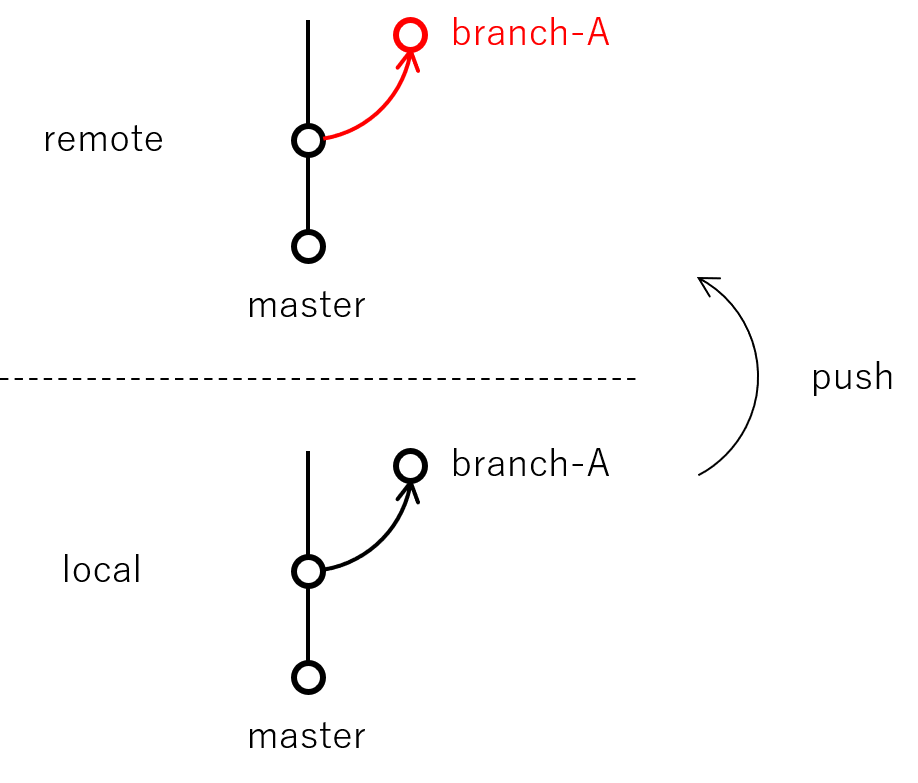
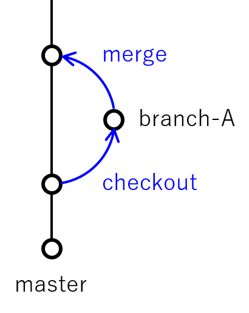
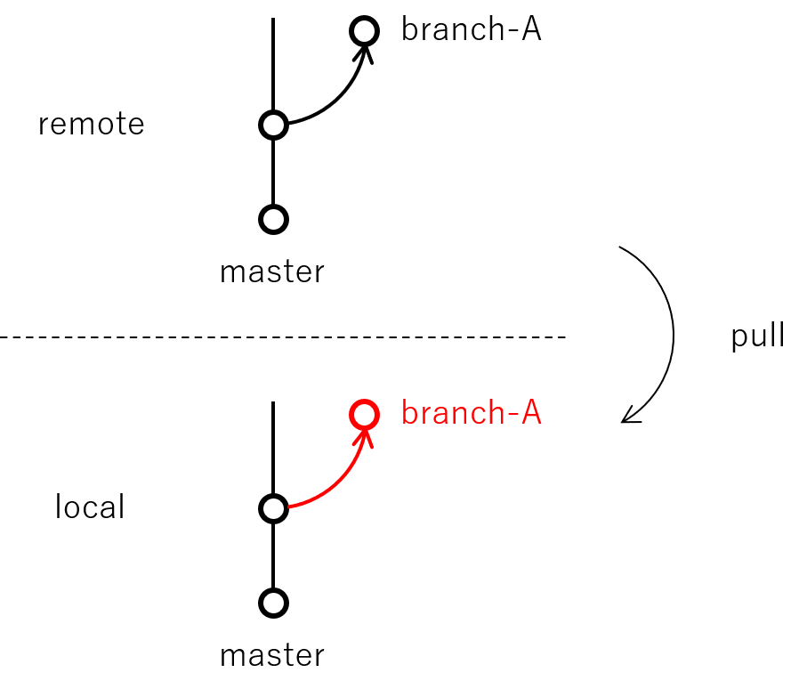
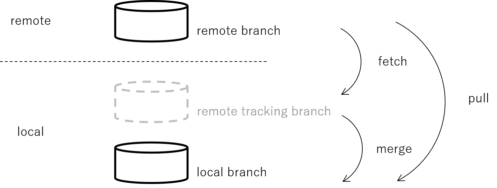

# Git について

## 目次

- [参考](#reference)

- [Git ホスティングサービス](#hostingService)

- [Source Tree](#sourceTree)

- [リポジトリ](#repository)

- [変更の記録手順](#recordProcedure)

- [ステージング](#staging)

- [コミット](#commit)

  - [コミットメッセージ](#commitMessage)

  - [直近のコミットメッセージを修正する](#modifyTheCommitMessage)

  - [コミット ID](#commitID)

- [チェックアウト](#checkout)

- [集中型と分散型](#centralizedModel&DistributedModel)

- [ホスティングサービス上の他アカウントのリポジトリをコピーする流れ](#copyRepositoryFromAnotherAccount)

- [フォーク](#fork)

- [クローン](#clone)

- [ブランチ](#branch)

  - [master ブランチ](#masterBranch)

  - [リモート追跡ブランチ](#remoteTrackBranch)

  - [ブランチの運用ルール (GitHub Flow)](#GitHubFlow)

  - [不要なブランチの削除](#deleteBranch)

- [プッシュ](#push)

- [フェッチ](#fetch)

- [マージ](#merge)

- [プル](#pull)

- [コンフリクト](#conflict)

- [プルリクエスト](#pullrequest)

- [大まかな開発の流れ](#developmentFlow)

- [.gitignore](#gitignore)

  - [.gitignore の書き方](#howToWriteTheGitignore)

  - [コミット済みのファイルを途中から無視する方法](#ignoreCommitedFilesInTheMiddle)

- [過去に戻って新規ブランチを作成、作業をやり直したい](#goBackToThePastCreateNewBranch)

- [リバート (過去のコミットの打ち消し)](#revert)

- [リベース (履歴を一直線にする)](#rebase)

- [スカッシュ (コミットを 1 つにまとめる)](#squash)

- [スタッシュ (未コミットのファイルを一時退避)](#stash)

- [チェリーピック (別ブランチから特定のコミットのみを取り込みたい)](#cherryPick)

- [タグ (コミットに目印を付ける)](#tag)

- [間違えて HEAD に直接コミットしてしまった時の対処](#misstakeCommitDirectlyToHead)

## <a id="reference"></a> 参考

### Web

- [IT STAFFING - エンジニアスタイル :【連載】マンガでわかるGit ～コマンド編～](https://www.r-staffing.co.jp/engineer/archive/category/%E3%83%9E%E3%83%B3%E3%82%AC%E3%83%BBGit)

### 書籍

1. 「わかばちゃんと学ぶ Git使い方入門」

  著 : 湊川あい  
  監修 : DQNEO  
  発行者 : 池田武人  
  発行所 : 株式会社 シーアンドアール研究所

## <a id="hostingService"></a> Git ホスティングサービス

- クラウド

  - GitHub

    誰でも簡単に公開リポジトリを何個でも作れる。  
    有料プランなら非公開リポジトリを何個でも作れる。

  - Bitbucket

    無料で非公開リポジトリを何個でも作れる。  
    (5 人までの小規模チームなら無料)

- オンプレ

  - GitHub Enterprise プラン

  - Bitbucket オンプレミスプラン

  - GitLab

  - GitBucket

## <a id="sourceTree"></a> Source Tree

GUI で Git 管理できるソフトウェア

## <a id="repository"></a> リポジトリ

過去の状態が記録された貯蔵庫  
`.git` の中に過去のファイル / ディレクトリ状態が圧縮されて蓄積される

## <a id="recordProcedure"></a> 変更の記録手順

以下の手順を繰り返すことで、履歴が記録されていく。  
(同時に複数ファイルを変更したけど、別々にコミットしたい場合は、コミットしたい単位でステージングする)

1. 作業 (新規作成 / 変更) する

  リポジトリ内で何らかの変化があると、それを Git が察知する

1. [ステージング](#staging)

1. [コミット](#commit)


## <a id="staging"></a> ステージング

```shell
$ git add (<対象ファイル>)
```

ステージングする理由

- 複数ファイルを小分けにコミットしたい

- いますぐコミットしたいファイルと、まだコミットしたくないファイルが混在してる

## <a id="commit"></a> コミット

バージョンを生成する操作

```shell
$ git commit (<対象ファイル>) -m "コミットメッセージ"
```

### <a id="commitMessage"></a> コミットメッセージ

コミット操作では、  
When, Who, What : コミットコマンド実行時に自動で記録  
Why : 自動記録不可能。コミットメッセージにより手動で記録

### <a id="modifyTheCommitMessage"></a> 直近のコミットメッセージを修正する

プッシュ前なら、簡単にコミットメッセージを修正可能

### <a id="commitID"></a> コミット ID

Git で行った各コミットは、変更内容を元に生成されるコミット ID (40 桁の英数字) で紐づけられている。

## <a id="checkout"></a> チェックアウト

```shell
$ git checkout <移動先>
```

過去のコミットした時の状態に戻れる。  
(指定した辞典のデータを作業ディレクトリにロードできる)  
-> 今いるコミットを移動する操作


## <a id="centralizedModel&DistributedModel"></a> 集中型と分散型

- 集中型

  中央リポジトリ (1 つ) に接続して、みんなで使う。  
  すべての操作はネットワークに接続した状態で行われる必要がある。  
  コミットは即時、中央リポジトリに反映される

- 分散型

  各自の環境にリポジトリを持ち、好きなタイミングで同期する。  
  オフラインでも履歴を確認できる。  
  リモートもローカルも対等な立場。  
  -> 本番環境に影響を与えずに実験できるし、いざとなったら簡単に復元できる。  
  ※ みんながアクセスできる場所に、中央リポジトリを置いておく必要がある。  
  (ホスティングサービスが使われることが多い)

## <a id="copyRepositoryFromAnotherAccount"></a> ホスティングサービス上の他アカウントのリポジトリをコピーする流れ

1. [フォーク](#fork) する

1. [クローン](#clone) する


## <a id="fork"></a> フォーク

fork : 分岐

他人が公開しているリモートリポジトリを自分のアカウントにコピーしてくる操作

## <a id="clone"></a> クローン

自分のアカウントのリモートリポジトリをローカルにダウンロードしてくる操作

## <a id="branch"></a> ブランチ

「単にコミットを指す軽量なポインタ」 (「今ここ！」を指し示すもの)  
これにより、他の開発に影響を与えずに、各々の作業を進めることができる。  
[チェックアウト](#checkout) でブランチ間を移動する。

### <a id="masterBranch"></a> master ブランチ

最初から (リポジトリ作成時に生成される) 存在するブランチのこと (「本流」という意味)  
本番用の最新版が保たれるようにするとよい。

### <a id="remoteTrackBranch"></a> リモート追跡ブランチ

ローカルリポジトリの中にあり、リモートブランチをローカルにミラーリング (コピー) しただけのもの (読み取り専用)

pull, push するとき、内部ではリモート追跡ブランチを経由して操作が行われている。

リモート追跡ブランチは、通常 `origin/master` という名前が付けられる。  

origin :  
ローカル上でのリモートリポジトリの呼び名。  
リモートリポジトリをクローンする時に自動で付加される。  
任意の名前に変更可能

### <a id="GitHubFlow"></a> ブランチの運用ルール (GitHub Flow)

GitHub やその他多数の Web 企業で採用されている、シンプルかつ効率的な運用ルール

[GitHub Flow - Gist@Gab-km (日本語訳)](https://gist.github.com/Gab-km/3705015)

- master ブランチ

  master ブランチの内容は、常に安定していて、いつでも本番反映できる状態にしておく。  
  基本的に、master ブランチでは作業をしない。  
  実際の作業は、後述する topic ブランチで行う。

- topic ブランチ

  新機能を追加したくなったり、デザインを修正したくなたら、目的ごとに master ブランチから新たなブランチを生やし、そこで作業する。  
  master ブランチに合流させたくなったら、プルリクエストを送る。  
  topic ブランチの名前は、パッと見たときに内容が想像できるものにする。  
  ex) add-facebook-button, fix-login-css

- GitHub Flow の 6 つのルール

  1. master ブランチはいつでも本番反映可能

  1. 新しい作業に取り組む際は、その内容を表す名前のブランチを作る

  1. ブランチを定期的にプッシュする

  1. フィードバックや助言が欲しくなったら、あるいは master ブランチにマージする準備が整ったら、プルリクエストを送る

  1. master ブランチへマージできるのは、他のメンバーにレビューしてもらって OK が出たものだけ

  1. master ブランチへマージされたら、直ちにリリースする

  これらのルールを守ることで、ブランチの一覧を見るだけで今どのような作業が行われているのか把握できる。  
  さらに、すべての変更が **<span style="color:red">プルリクエスト -> 他メンバーからのレビュー -> マージ</span>** という工程をたどるため、「誰もチェックしていないソースコード」が master にマージされることを防げる。

### <a id="deleteBranch"></a> 不要なブランチの削除

使用しないブランチは、以下の手順で削除する。

1. リモート追跡ブランチを削除

1. リモート追跡ブランチの状態をリモートにプッシュ

1. ローカルブランチを削除

他メンバーが削除したリモートブランチを、ローカルでも削除したい場合は、

1. フェッチして、リモートブランチの状態をリモート追跡ブランチに反映する

1. ローカルブランチを削除

## <a id="push"></a> プッシュ

ローカルリポジトリでの変更内容をリモートに反映する操作  
(ローカルリポジトリのコミットがリモートより先行している状態で行う)



## <a id="fetch"></a> フェッチ (リモートリポジトリから最新の状態を取得)

リモートリポジトリの最新の状態は取得したいけど、まだローカルブランチに反映させたくないという時などに行う操作

## <a id="merge"></a> マージ (リモート追跡ブランチをローカルブランチに反映)

異なるブランチでの変更を自ブランチに取り込む操作  
(他ブランチを自ブランチにくっつけるイメージ)

フェッチしただけだと、リモート追跡ブランチ (origin/master) にコミットがダウンロードされただけで、ローカルブランチ (master) は更新されていない。  
リモート追跡ブランチの内容をローカルブランチに反映させたくなったら、マージ操作する。



## <a id="pull"></a> プル

リモートリポジトリの内容をローカルリポジトリに反映する操作  
(リモートリポジトリのコミットがローカルより先行している状態で行う)





## <a id="conflict"></a> コンフリクト

コンフリクト : 衝突

マージの際、同一行が変更されていた時など、Git がどちらを優先すべきか判断できないときに発生する。  
(同一ファイルでも、異なる行の変更なら、コンフリクトは発生しない)

```shell
<<<<<<< HEAD
AAAAAA
=======
BBBBBB
>>>>>>> other-branch
```

修正方法 :  
  不要な記号を削除して、残したい行のみに変更すればOK。  
  あとは、ステージングしてコミットする。  
  (コミットメッセージが自動で生成されるが、任意で書き換える)

## <a id="pullrequest"></a> プルリクエスト

master ブランチに自分が行った変更を取り込んでもらうように、依頼 / 提案すること  
(自分のブランチを取り込んでください。というお願い)

## <a id="developmentFlow"></a> 大まかな開発の流れ

1. Fork

1. Clone

1. Branch

1. Modify the files

1. Staging

1. Commit

1. Push

1. Pull-request

  修正依頼があった場合は、Modify the files から繰り返す

1. Merge

## <a id="gitignore"></a> .gitignore

- OS が自動生成するファイル

- キャッシュファイル

- 容量が大きすぎるファイル

のようなバージョン管理をしたくないファイル / ディレクトリをリスト化したファイル。

プログラミング言語やフレームワークによって、最適な「.gitignore」の設定が異なる。  
GitHub が提供しているリポジトリに、様々な「.gitignore」の例が載っている。  
[GitHub - A collection of useful .gitignore templates](https://github.com/github/gitignore)

### <a id="howToWriteTheGitignore"></a> .gitignore の書き方

特定のファイルを無視したい

```git
# 自分用のメモファイルを無視
memo.txt
```

特定の拡張子を無視したい

```git
# .rbc という拡張子がついているファイルを無視したい
*.rbc
```

特定のファイルを無視しない (例外設定)

```git
# 例外として、test.rbc は無視しない
!test.rbc
```

特定のディレクトリ以下を無視したい

```git
# templates_c というディレクトリ以下を無視したい
templates_c/
```

ルートディレクトリ直下にあるものを指定したい

```git
# ルートディレクトリ直下にある log というディレクトリ以下を無視したい
/log/
```

コメント

```git
# 行頭に # を入力するとコメントできる
```

### <a id="ignoreCommitedFilesInTheMiddle"></a>コミット済みのファイルを途中から無視する方法

以下の手順で操作する

1. 追跡を止める

  ローカルリポジトリにファイルを残したまま、インデックスのみ削除する。

  ```shell
  $ git rm --cached <対象ファイル>
  $ git commit -m '<対象ファイル> を追跡から除外しました'
  ```

  ※ 誤って `--cached` オプションをつけ忘れた場合は、以下の操作で回復させる

  ```shell
  $ git reset @~ <対象ファイル>
  $ git checkout <対象ファイル>
  ```

1. 「.gitignore」に追加する

  上述の「.gitignore の書き方」に沿って、対象ファイルを追加し、コミットする。

  ```shell
  # 対象ファイルを .gitignore に追加 (必要に応じて vim で編集してコメントを追加する)
  $ echo <対象ファイル> >> .gitignore
  # コミット
  $ git commit -m '<対象ファイル> を .gitignore に追加'
  ```

## <a id="goBackToThePastCreateNewBranch"></a> 過去に戻って新規ブランチを作成、作業をやり直したい

1. 戻りたいコミットにチェックアウト

1. 新しいブランチを生成

1. コミット

## <a id="revert"></a> リバート (過去のコミットの打ち消し)

リバート (revert) :  
コミット 1 件を逆適用すること  
過去のコミット自体を削除するわけではなく、あくまでも反対の内容で **<span style="color:red">新規コミットを作ることで、過去の変更を打ち消す</span>**

## <a id="rebase"></a> リベース (履歴を一直線にする)

マージの場合は、過去のコミットは改変されずに、ブランチが統合されるが、  
リベースの場合は、過去のコミットを改変し、履歴を一直線にすることができる。  
(ブランチの付け根を植え替えるイメージ)

メリット :  
履歴を見たときに、何を変更したのか分かりやすくなる (ブランチ単位で履歴が並ぶため)  

デメリット :  
過去のコミットを改変するため、コンフリクトの危険がある。  
つまり、コミットを新しく作り直しているため、リベース前後でコミット ID が変化する。  
すでにリモートリポジトリに存在しているブランチをリベースしてしまうと、通常の方法ではプッシュできなくなってしまう。

## <a id="squash"></a> スカッシュ (コミットを 1 つにまとめる)

何度も追加修正してしまい、プッシュ前の履歴が乱雑になってしまった場合は、スカッシュすることで履歴を 1 つにまとめることができる

注意 :  
<span style="color:red">プッシュする前に限る</span>  
コミットが既にリモートリポジトリに存在する状態で履歴を改変すると、他メンバーのリポジトリと差異ができてしまい、混乱の元になる。

## <a id="stash"></a> スタッシュ (未コミットのファイルを一時退避)

stash : こっそりしまう。隠しておく。

割り込み作業が発生したときなど、作業途中の内容を一時退避して、ブランチを移動したいときやプルしたいときに役立つ。  
作業ディレクトリの変更内容を、一時的に別の場所へどけておくことができる。  
どけておいた変更内容は、あとで復元できる。

## <a id="cherryPick"></a> チェリーピック (別ブランチから特定のコミットのみを取り込みたい)

cherry-pick : 熟れているサクランボだけを選んで摘み取る = いいとこ取り

好きなコミットを選んで摘み取る事ができる。  
〇〇ブランチにコミットするはずが、間違えて別ブランチにコミットしてしまった時などに、任意のコミットを今いるブランチの上にコピーしてこれる。

※ あくまでも特定のコミットを、今いるブランチ上にコピーして来るだけなので、コミットを移動させるわけでは無い。  
 (元のコミットは残ったまま)

## <a id="tag"></a> タグ (コミットに目印を付ける)

履歴上の重要なポイントに目印を付けることができる。  
たとえば、以下の時にタグを使う

- アプリ開発で、リリースしたときにバージョン番号のタグを付ける

- 受託開発で、納品したときに日付のタグを付ける

- ウェブ開発で、リニューアルオープンしたときにタグを付ける

## <a id="misstakeCommitDirectlyToHead"></a> 間違えて HEAD に直接コミットしてしまった時の対処

過去のコミットにチェックアウトした後、そのまま新しいコミットを作ったら、HEAD という印が出た。。。

これは、detached HEAD 状態といい、どのブランチにも所属していない状態を表している。

このままでもコミットを積み重ねる事もできるが、次にチェックアウトしたときに戻れなくなってしまう (目印がないから) 。

通常は、基本的に、HEAD はブランチを指している。  
detached HEAD 状態では、HEAD が直接コミットを指してしまっている。
HEAD が分離した状態でコミットしてから、master ブランチにチェックアウトすると、分離した状態で行ったコミットが消えてしまう。。。

HEAD に直接コミットしてしまったら、新規ブランチを作ることで解決できる。

解決までの流れ :

1. 最初の状態

  

1. 過去のコミットに戻る (HEAD が分離して、コミット ID を指した状態)

  

1. HEAD が分離した状態でコミット

  

  この状態で master ブランチにチェックアウトすると、コミット D が消えてしまう。。。

1. 慌てずに新規ブランチを作成 (通常の状態に戻る)

  

