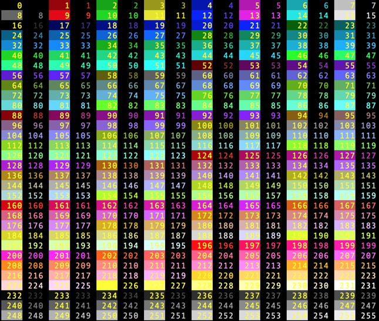

# Vim


## 目次

- [文字コード変更](#changeCharSet)
- [各種定義ファイル](#runCommandFiles)
- [カラースキーマ](#colorScheme)


## <a id="changeCharSet"></a> 文字コード

### 参考

- [Qiita: Vimで文字コードを指定する](https://qiita.com/bezeklik/items/2c9925f9c07762559471https://qiita.com/bezeklik/items/2c9925f9c07762559471)

### 確認

```vim
# Vim のエンコード
:se enc?

# ファイルのエンコード
:se fenc?
```

### 開き直す

```vim
# Long command
:edit ++encoding=[char set]

# Short command
:e ++enc=[char set]
```

### 保存

```vim
# Long command
:set fileencoding=[char set]

# short comannd
:se fenc=[char set]
```

## <a id="runCommandFiles"></a> 各種定義ファイル

### 参考

- [Qiita: vimで読み込まれるファイルについて](https://qiita.com/okamos/items/8279154e20249247f78f)

### 読込み順

以下のコマンドで表示されたディレクトリの順にファイルを読み込む

```vi
:set runtimepath
```

GVim でのデフォルト (?)

```
runtimepath=~/vimfiles,C:\Program Files (x86)\Vim/vimfiles,C:\Program Files (x86)\Vim\vim82,C:Program Files (x86)\Vim\vimfiles\after,~/vimfiles/after
```

## <a id="colorScheme"></a> カラースキーマ



